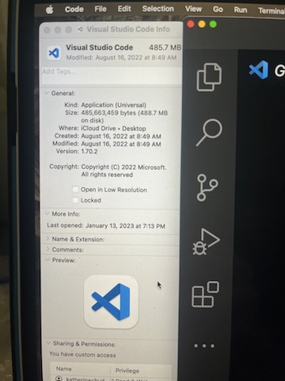
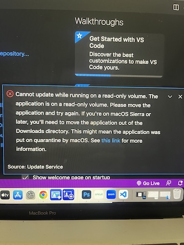
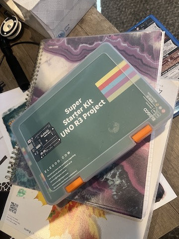
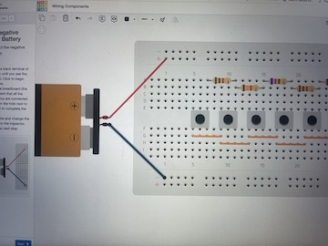
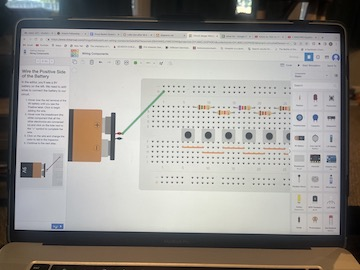
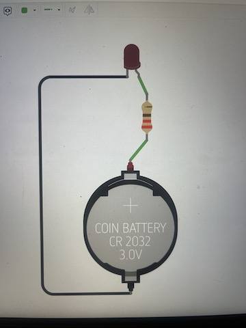

# January 15 At Home Kit  

I looked around the house and found my old Arduino Super Starter Kit. After carefully removing all the parts, I figured out I had most of what I needed to do the lab at home. I had a really rough weekend for several reasons and between that and the holiday, I was not able to coordinate with Tevin or anyone else to meet at FAB Lab to complete the project. The graduates had a lot to do between a DEI meeting, the artist lecture, and prepping for the show, which made getting there next to impossible.  

I also made an account in TinkerCad and I really love it. I think that part of the problem I had last semester is that it was all abstract and there was not anything materially that I could grab onto mentally. I am already faring much better with the electronic components, and I am very excited to see where this takes my artwork. I have been doing extra lessons on the side and also practicing my skills by showing Josh and teaching him how to do the circuits.  

I also had some weird issues with VSC and it needing updates, which was complicated by it not being in applications but on the remote desktop (mac desktop is in the cloud). Here are some photos of my error messages:  

 
   

Here is the kit:  

  

Here are some photos of the lessons I tried in TinkerCad:  

  
  
  

I've been trying to fix the images and have no idea what I'm doing wrong. I'm going to stop and try to do some research.
