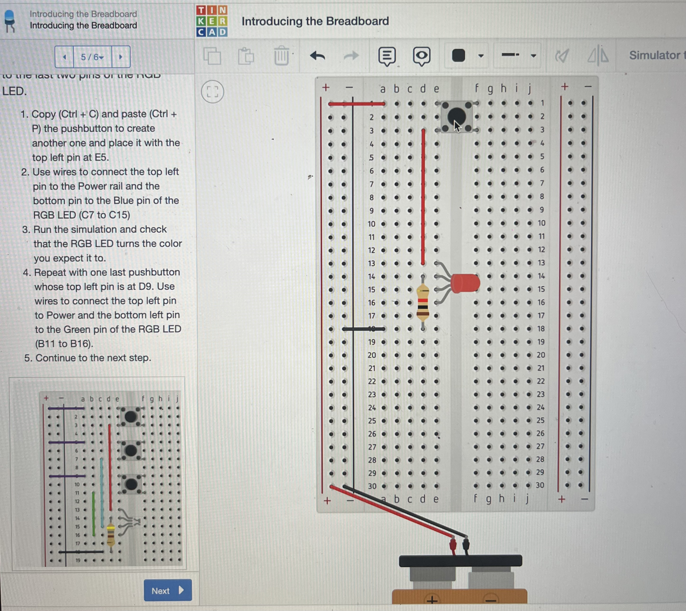
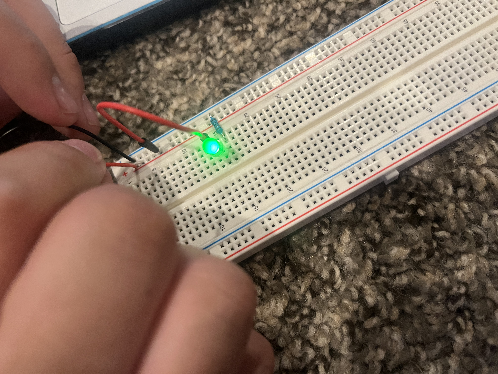
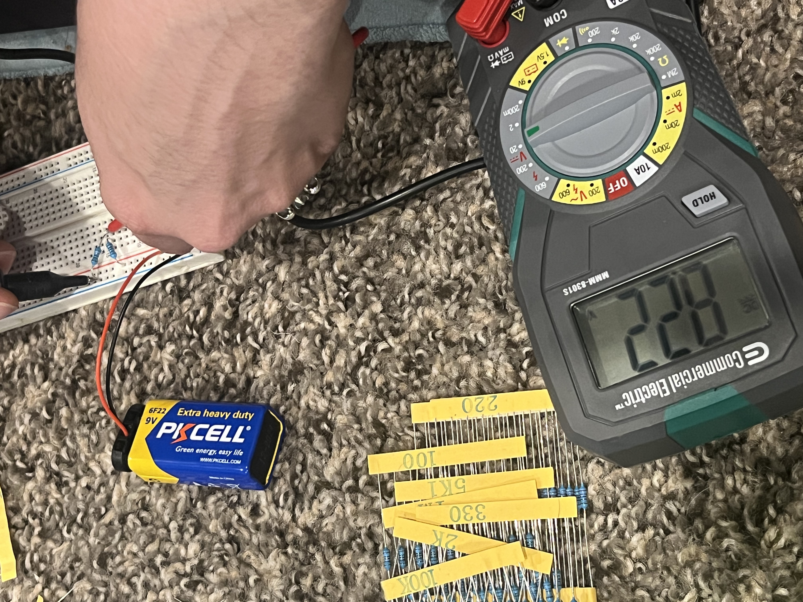
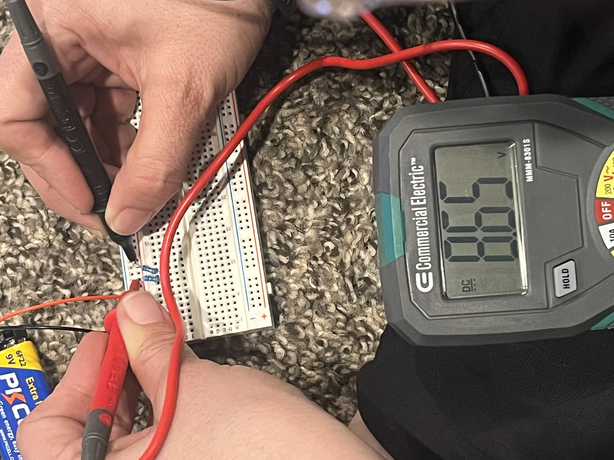

# January 17 At Home Kit  

I tried some more of the TinkerCad lessons. I'm trying to do a few here and there when I have some down time. They're small enough to make this manageable.  

  

I already have some thing I want to try for this class, even if it isn't finished at the end of the semester. I'm feeling ambitious and I really want to try to do this for one of the projects.  

I've just got to say that getting used to putting two spaces after the end of a passage after having it drilled out of me is weird.  

I want to create a projected sigil that uses the xbox kinect to register areas being touched/interacted with and then have it make changes to the image.  

  

Here are some pictures from doing Lab 1:  

  

And Lab 2:  

  
