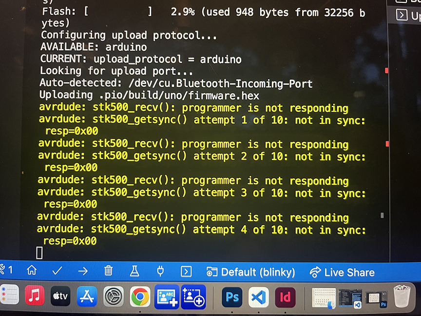
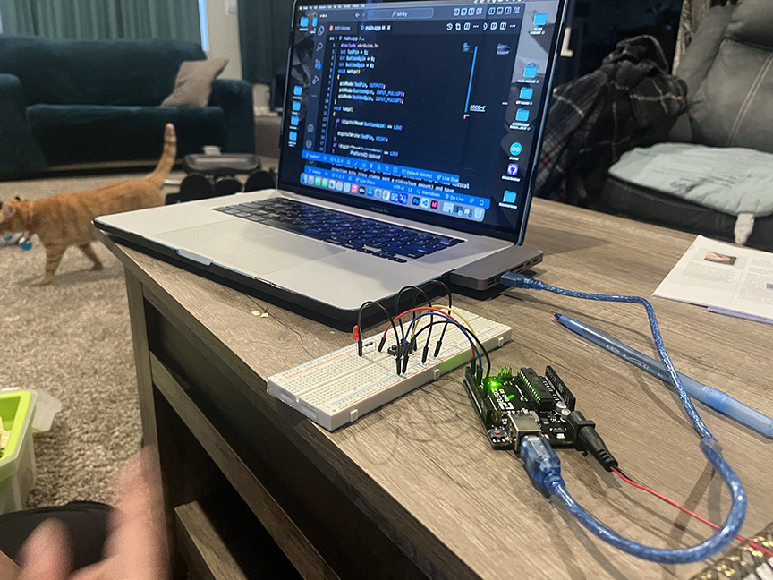
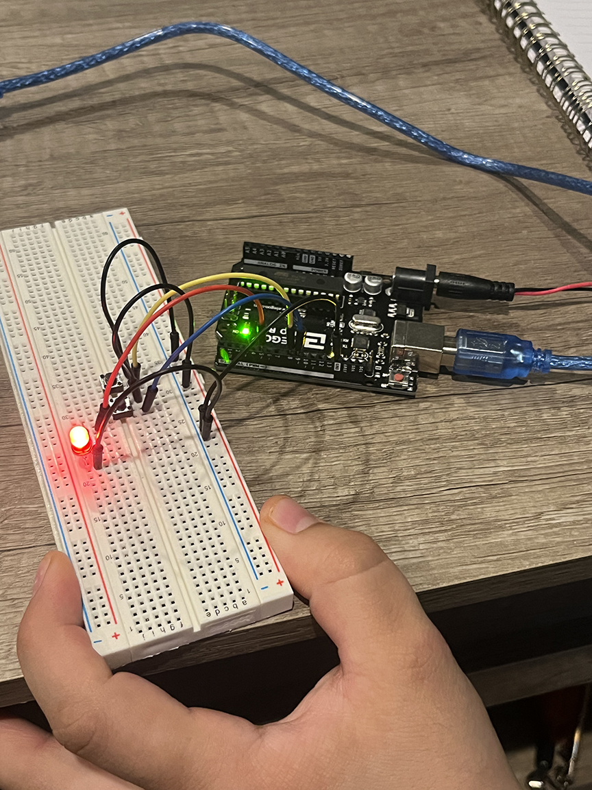

# January 22 At Home Kit  

This lab was super easy. I only ran into one problem, which was my USB connection being loose. It's something I've had issues with before, so I'm not surprised. I'm really happy and excited that I'm getting better at trouble shooting my problems.  

Josh and I went through all the steps together. We are having so much fun and are enjoying learning this as much as we enjoy doing printmaking together. We're excited to start working on some installations together and start incorporating electronics into our artwork.  

  
  
  

Reading everything backwards is definately helping. I caught that the file extensions change depending on where I'm grabbing them from and can be .jpg or .jpeg or .JPG or .JPEG and any difference will screw things up. When I read my lines in markdown backwards, I'm immediately like OH THE FILE NAME IS DIFFERENT.  
