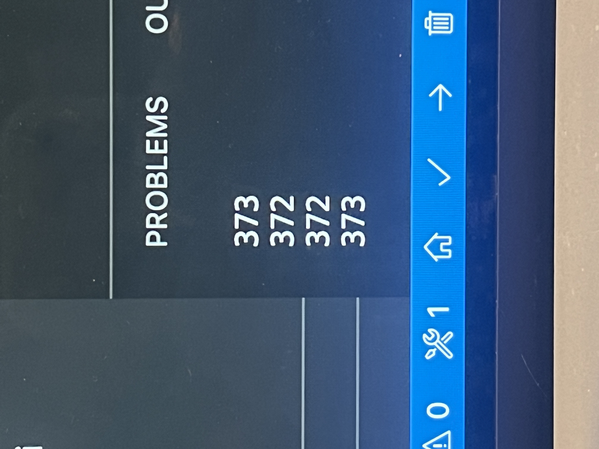
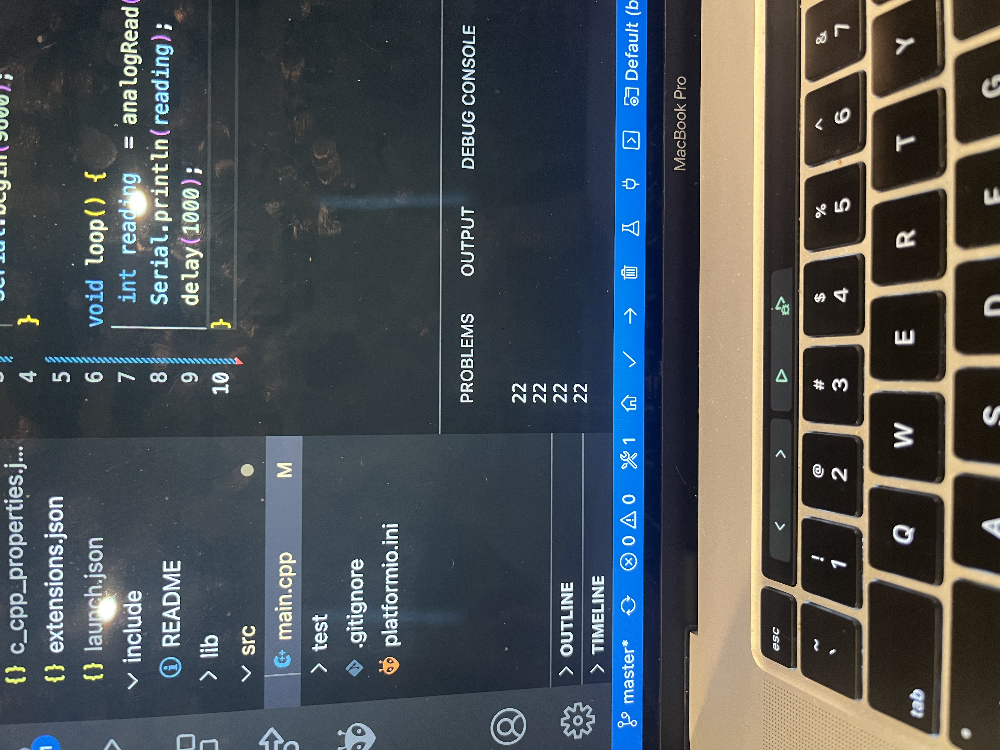
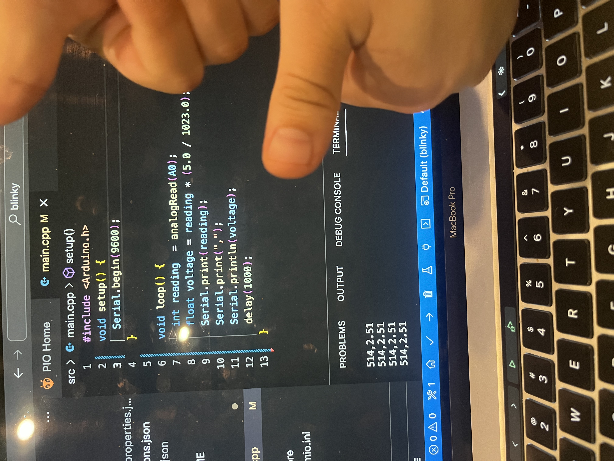
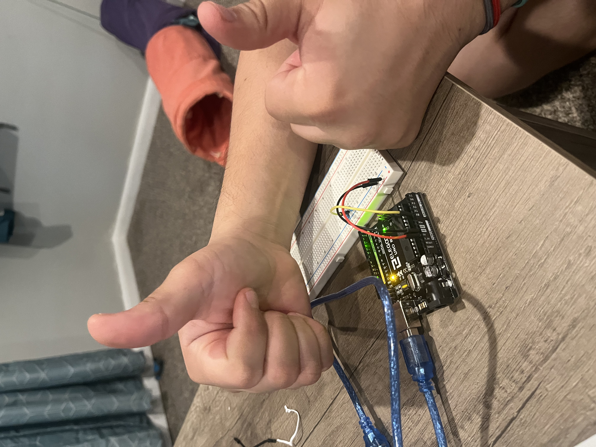

# January 31 At Home Kit 3 and 4  

The last lab was a lot harder, and I think I figured out a few more of my problems in terms of approach. I think I need to stop trying to understand the labs at a deep, theoretical level and just do them. I keep starting, and then freezing at a point trying to figure out if I even know what's going on. If I just keep working through the lab, I start understanding what's going on as I work. I'm starting with reading through the entire lab first, and I've done that just now before I sit down to do it later this afternoon.  

I'm still playing with tinkercad and doing the exercises which I also think is helping a lot. I had to figure out why something wasn't working on one of the lessons, and the new ways of approaching something not working are servin me well so far.  

## At Home Lab 3  

  
  
  

## At Home Lab 4  

  
  
