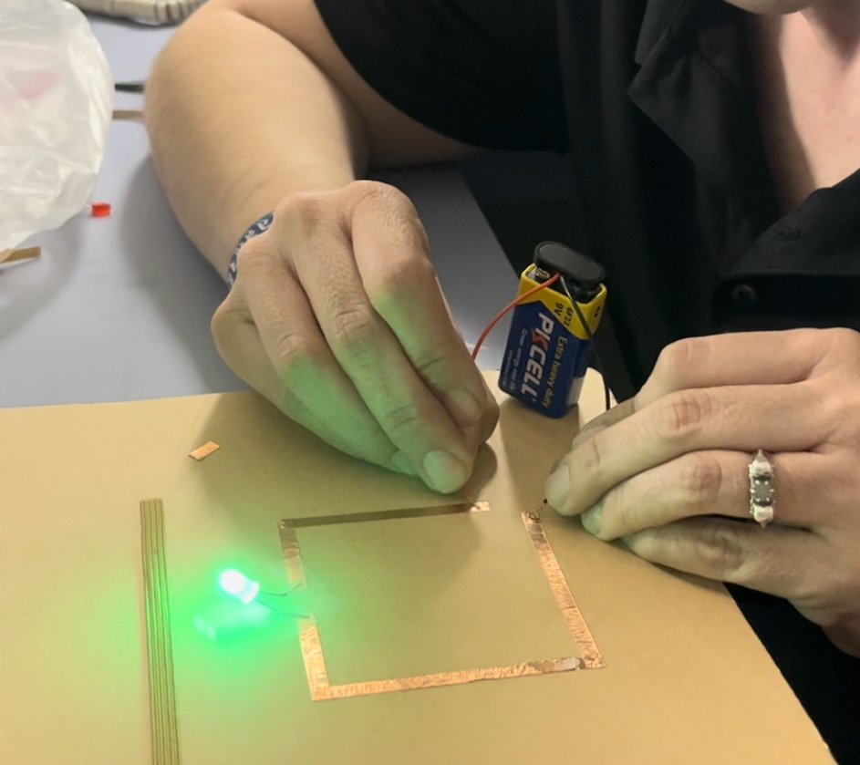
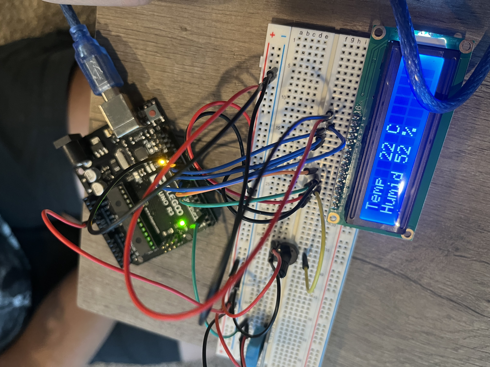
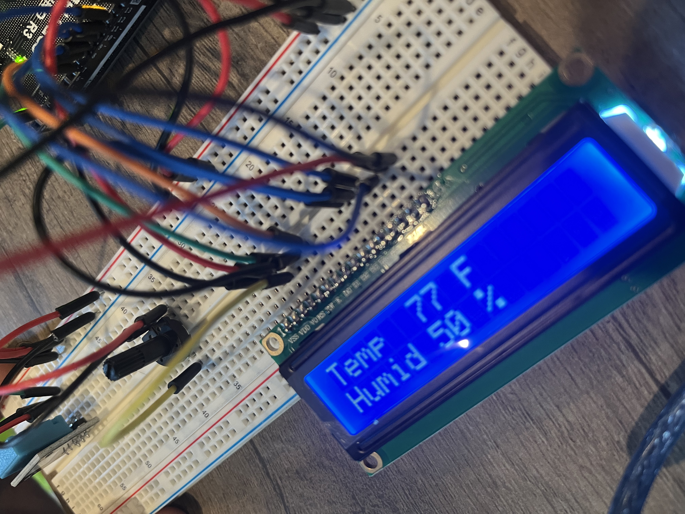
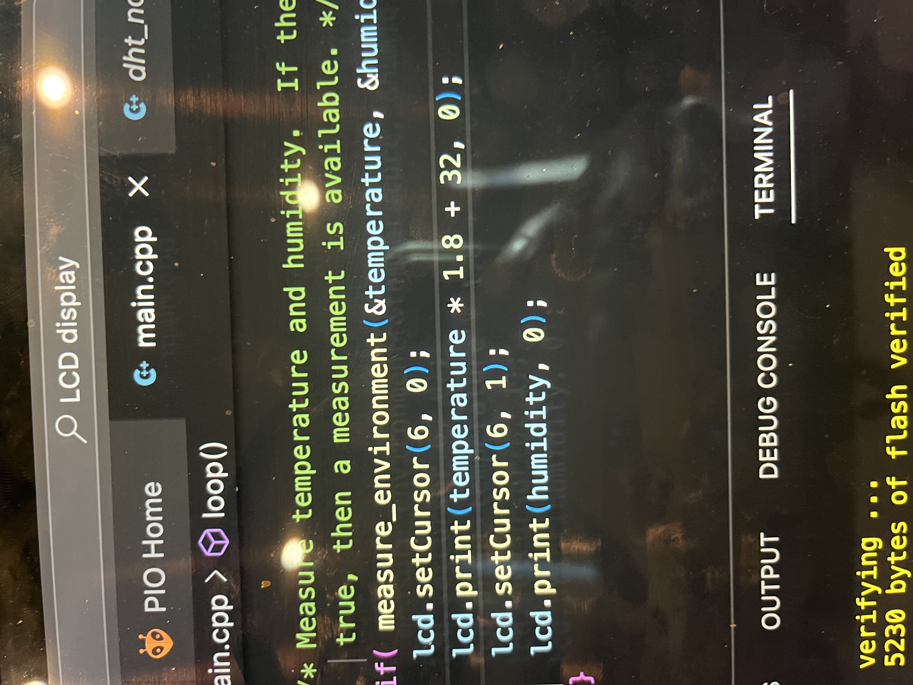
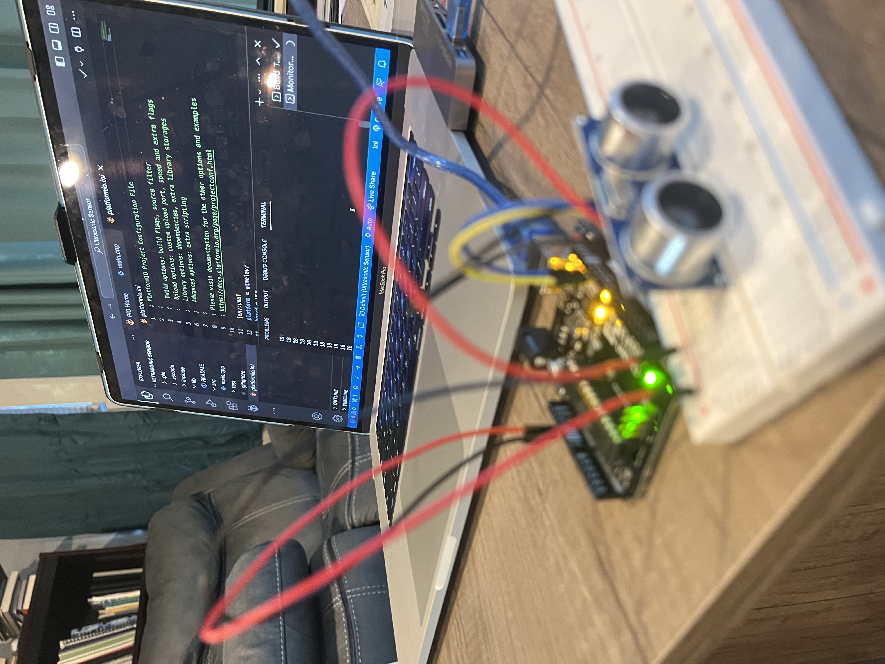

# February 4 At Home Kit 4B  

I have been playing with making paper circuits with some copper tape I bought in the stained glass section of Hobby Lobby. The first project I made was a simple led circuit on my sketchbook. I forgot about the amount of power, and ended up blowing the led because I was using the 9V battery.  

  

My next paper circuit will be an led circuit with the 9V battery and one or two resistors. I am going to also try setting up a paralell circuit with leds.  

I am curious about the idea of sculptural circuits. We had spoken in class about only needing a thin layer of copper, but I want to create a few cut out pieces from copper sheets to solder leds and sensors to and make wearable jewelry pieces. I have plenty of etching plates lying around, and will spend the next week cutting out a few shapes to play with. I want to buy some smaller batteries, like coin batteries, so I don't have to worry about blowing anymore leds or having to add extra components. I want to consider the copper tape as a conceptual and formal element in the artwork, and explore it as a mark making matrix, as well as a functional material.  

I left the setup the way I had it and made sure it was still working. Then I started following the steps for the lab to set up the temperature and humidity sensor. I want to go back next weekend and redo these labs up to this point just to practice everything again. Everything went fairly smooth, except for a 10 minute lapse where I could not for the life of me remember how to pull up the serial monitor.  

  
  
  

I initially tried to complicate this formula way to much, thinking I had to go back into the source files to find how the const was defined to begin with. Then, I started thinking about how to change it more towards the end or output stage and it made more sense.  

  
  
