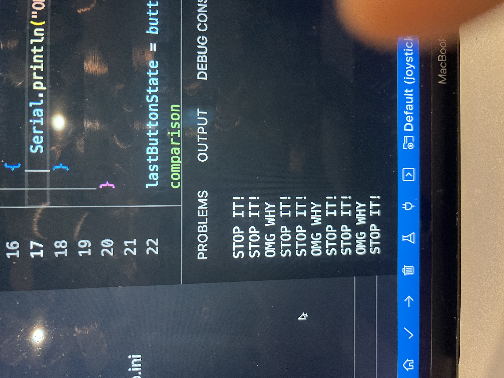

# At Home Kit 5A Joystick  

The rainbow strip was initially difficult to use, as it required a bit of extra pressure to get the pins on the chip to fully engage. I was worried it was going to break, but everything was fine after a few extra pushes on the connectors.  

On the input pullup part, I switched the "INPUT_PULLUP" for "INPUT" but did not see the last number flipping, but the middle one. I tried to figure out what was wrong and just ended up moving on.  

Challenge: Can you change the code so that it only sends a message when the state goes from HIGH to LOW?
Hint: it's the if statement that would need to change.

I tried to change a few things and got triads of information to show up. I tried adjusting things by adding a new global variable, new local variable, and I also tried and if/else statement that didn't work.  

  
  
  
  
