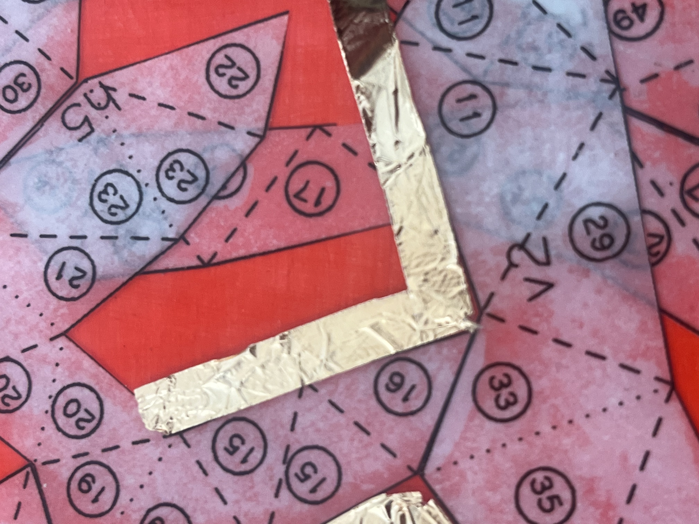
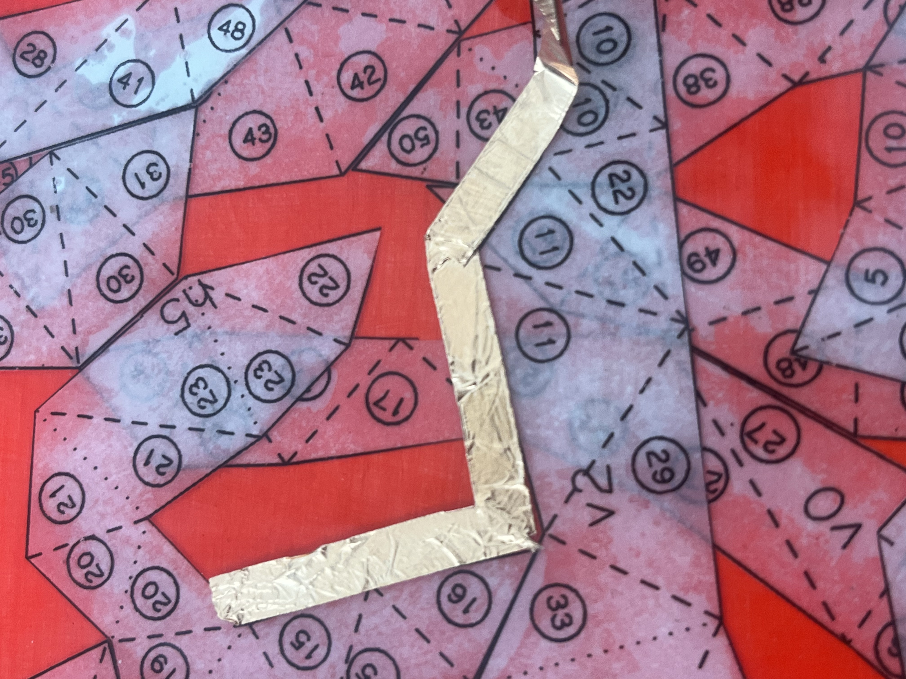
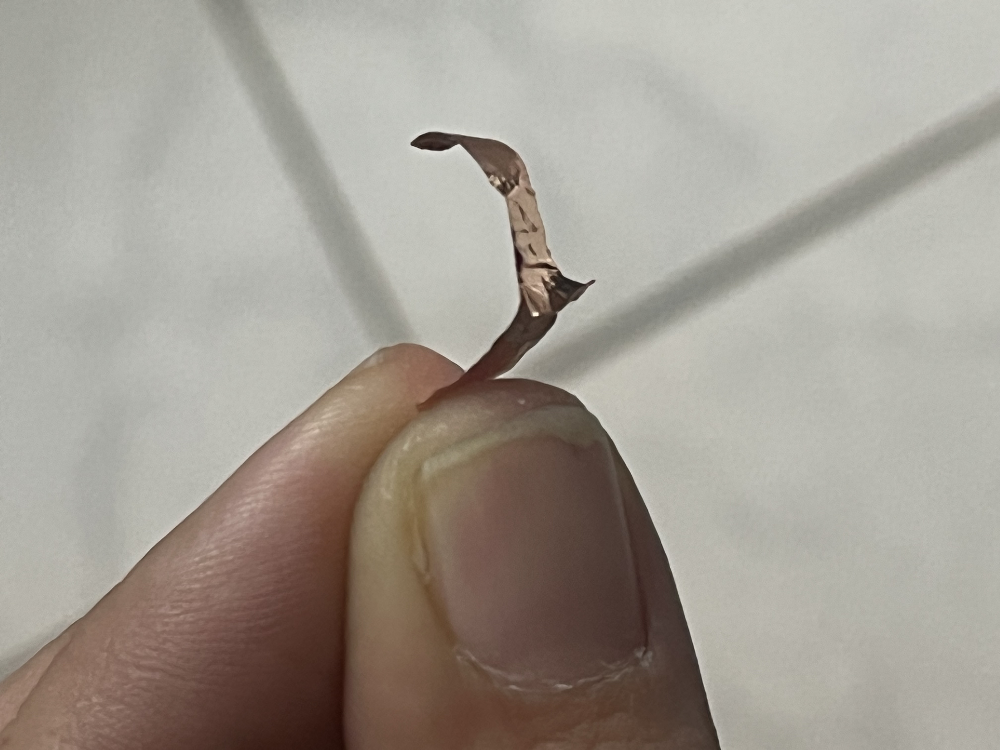
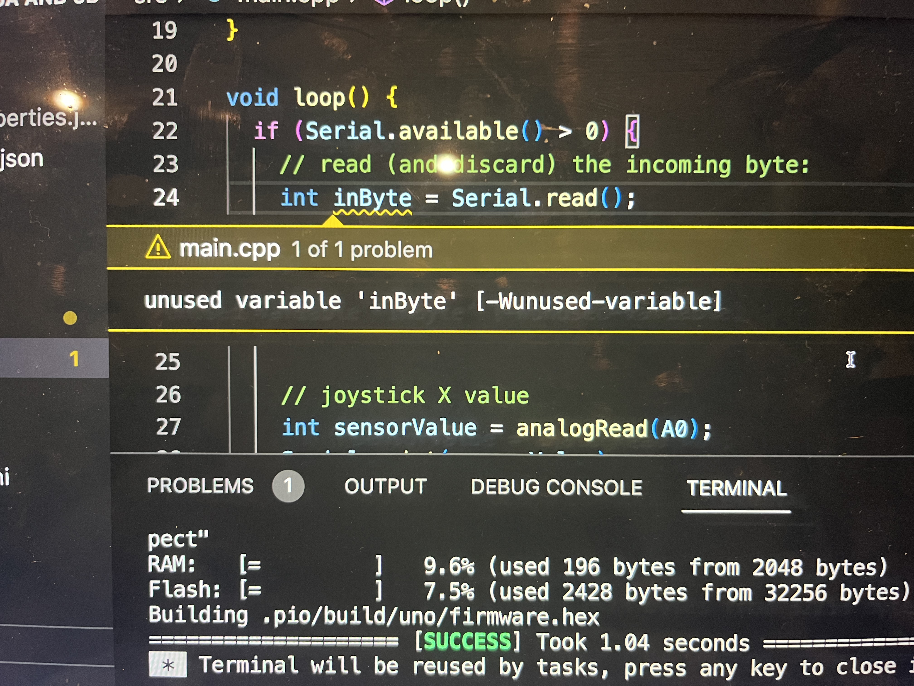
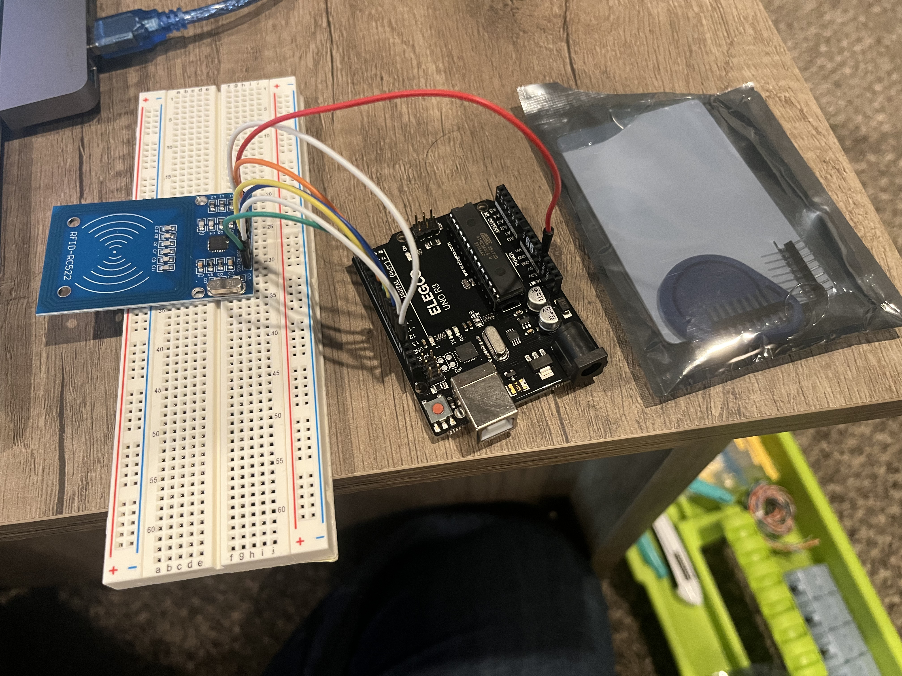

# At Home Kit 5B  

I did not finish the second half of the lab and decided to work on other things while I wait to ask questions. I did some Tinker Cad lessons on paralell and series circuits.  

  

I ordered some sequin LEDs, two wearables circuit setups, a bunch of paper circuit supplies, and conductive ink and paint. I am still experimenting with the copper tape and had some really exciting moves forward. After playing with the material for a week and a half, I finally got the copper tape to fold correctly for up to a 120 degree bend. Anything beyond that requires tearing or breaking the copper strip, but this can be worked around by using what I am calling a "copper band aid" - a strip of the adheive backed copper tape with a smaller piece attached upside down to the adhesive side of the first strip. This is then placed over a break in the line, which allows the current to jump from one broken side, across the bandaid strip, and back down to the other side of the broken line.  

  
  
   

I also ordered some quinacridone red printmaking ink - the primary pigment that composes the ink is known to have some extremely strange conductive properties due to chemistry. I know that there are paints and inks made to be conductive, I am just particularly interested in the electrochemical properties of this particular organic pigment.  

Here are some of the links to research I have been looking at in relation to the quinacridone pigment:

[ACS] <https://pubs.acs.org/doi/10.1021/cm300514z>  
[NH] <https://www.ncbi.nlm.nih.gov/pmc/articles/PMC4529658/>
[PUBS] <https://pubs.rsc.org/en/content/articlelanding/2016/tc/c6tc03621j>  

I tried the lab again, and after digging I think I found the error but don't know how to fix it.  

  

I also decided to see if I could set up the RFID system with the arduino. I think I did everything right, I just think I need to actually solder the pins to the RFID reader.  

  
  
