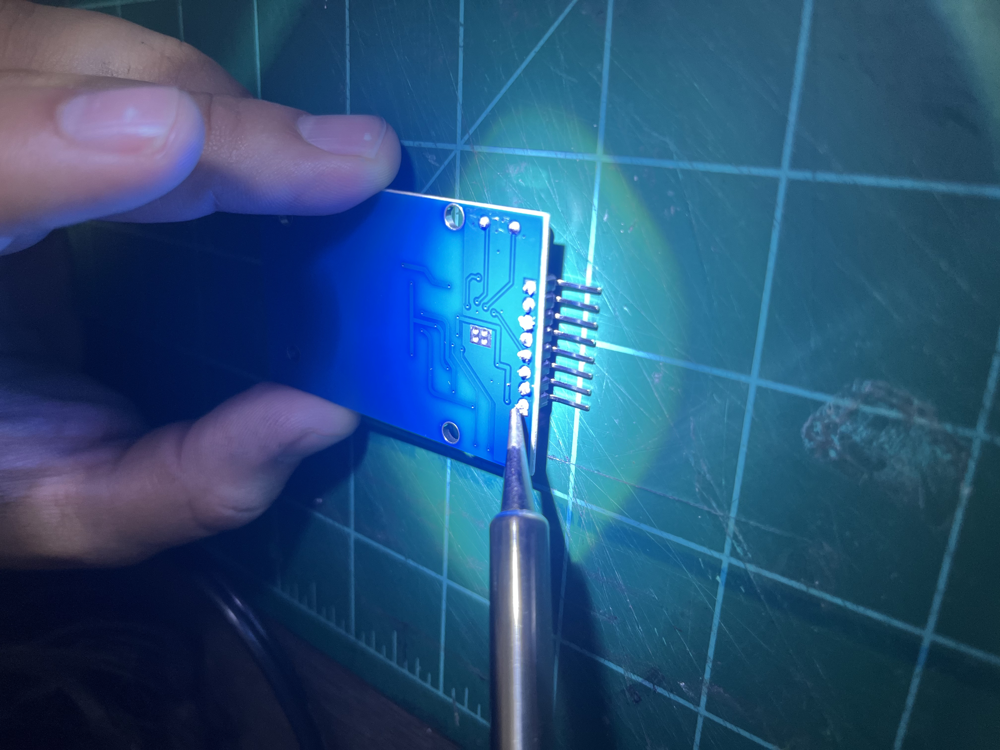
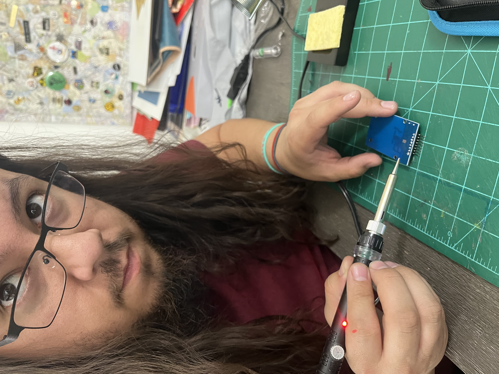
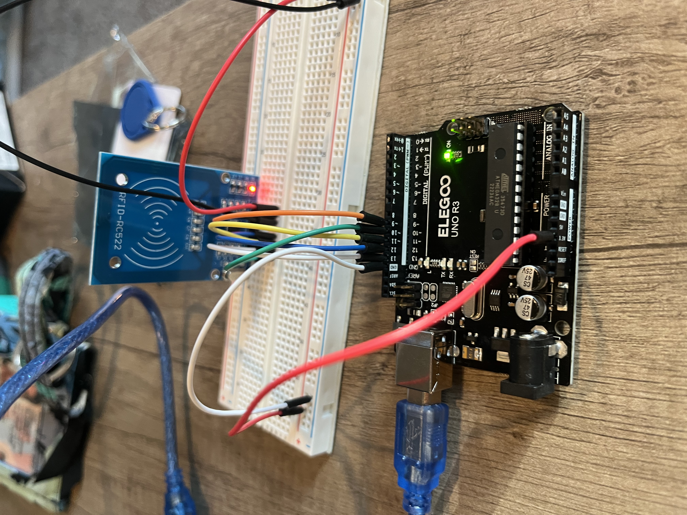
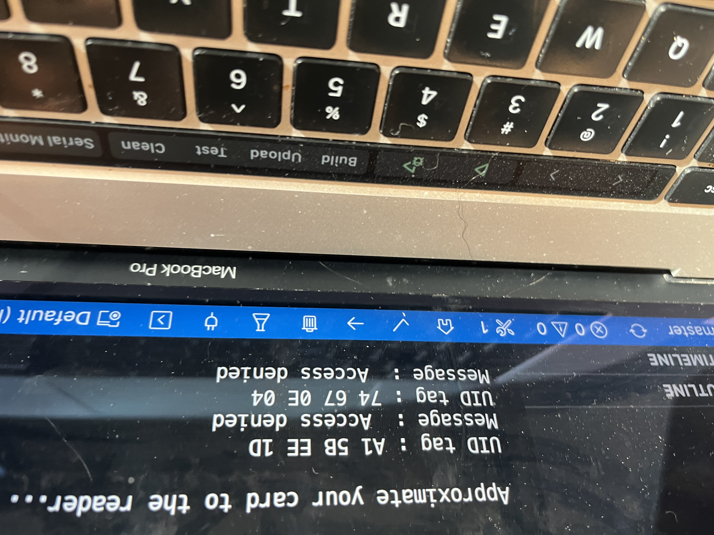

# Midterm Project  

Soldering seemed a little intimidating, especially soldering a whole row of pins. I had Josh help me set up a little station on the table, and we tried first soldering to the front. It didn't seem like that was working well, so we flipped the card and soldered from the back.  

  
  
  
  

I am doing the sketching and setup for the set of images that will be recalled when one or more of the rfid tagged bone forms are placed on the reader. I tried to pare it down to keep it mathematically simple, as even adding one additional bone expands the number of options. This is the basic list of singular and combination reads that are possible with four forms:  

1,2  
1,3  
1,4  
2,3  
2,4  
1,2,3,4  
2,3,4  
1,2,4  
1,2,3  
1  
2  
3  
4  

This is a total of 13 singular comibnations. This could be expanded out further if inputs could be doubled: if the 1 could be read twice instead of in combination with 2,3 or 4.  

I am currently researching the ability of the reader to pick up more than one tag and found this:  

[RFID] <https://www.rfidjournal.com/question/how-many-tags-can-be-read-by-an-rfid-reader-at-one-time#:~:text=Technically%2C%20all%20RFID%20readers%20can,to%20distinguish%20one%20from%20another.>  

I am going to try and and see what happens, and if I can only get one to read at once I can still incoroporate the potentiometer as a secondary interactive component. I have made one board, which I plan on having the components intentionally exposed as part of the concept of the biological meeting the industrial mechanized world of medicine.  

  

I am planning on trying a multi reader setup as well, to see if I can have two readers interacting with multiple objects on the board.  I found this code through Hack-a-day:  

[RFID] <https://github.com/Annaane/MultiRfid>  
