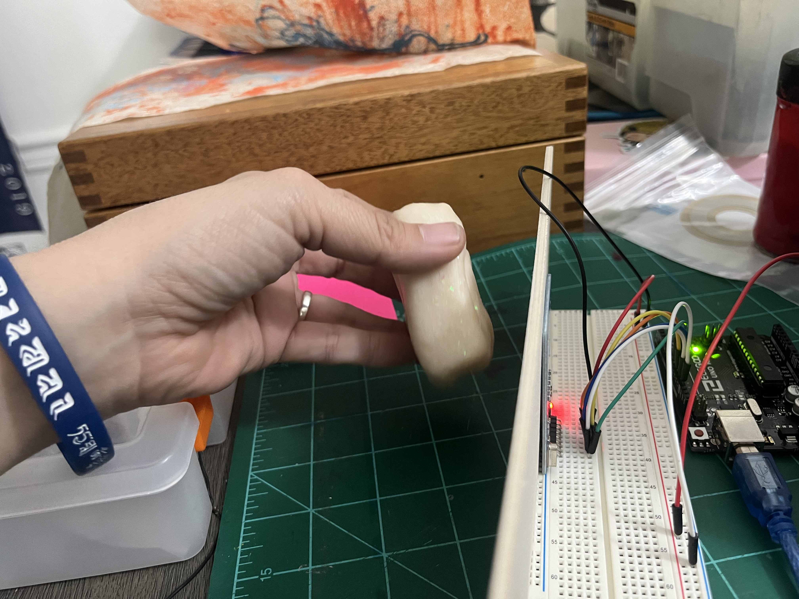
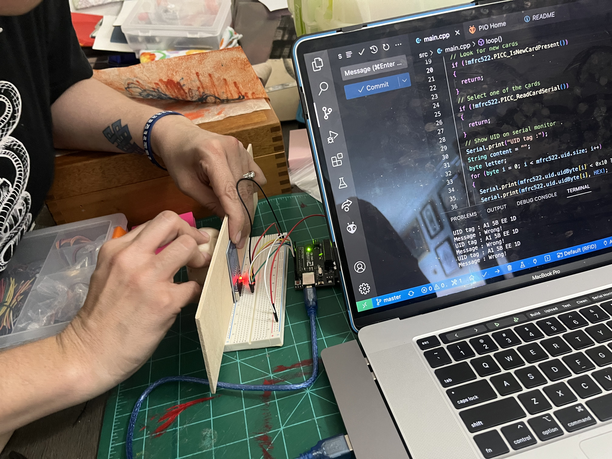
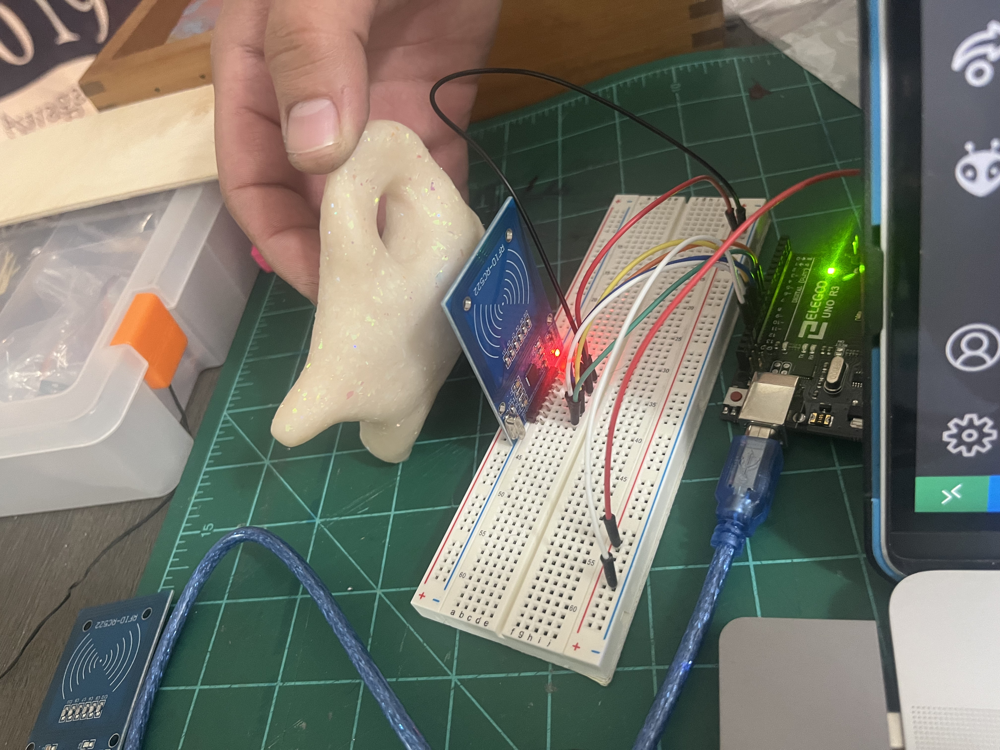

# Midterm Project  

I took this last week to work out the box itself and the physical components in relation to the RFID reader. I didn't want to wait until the end to deal with aesthetics and troubleshooting materiality.  

First, I tried to see if I could lodge the RFID tag into the clay shallow engouh that it could still be read through the plastic.  

  

Then, I wanted to make sure I could read the clay form through the wooden surface the RFID reader would be underneath.  

  

Finally, I cooked the RFID reader into the clay and tested it after a slow and low cook (200 degrees F). It surprisingly worked!  

  
