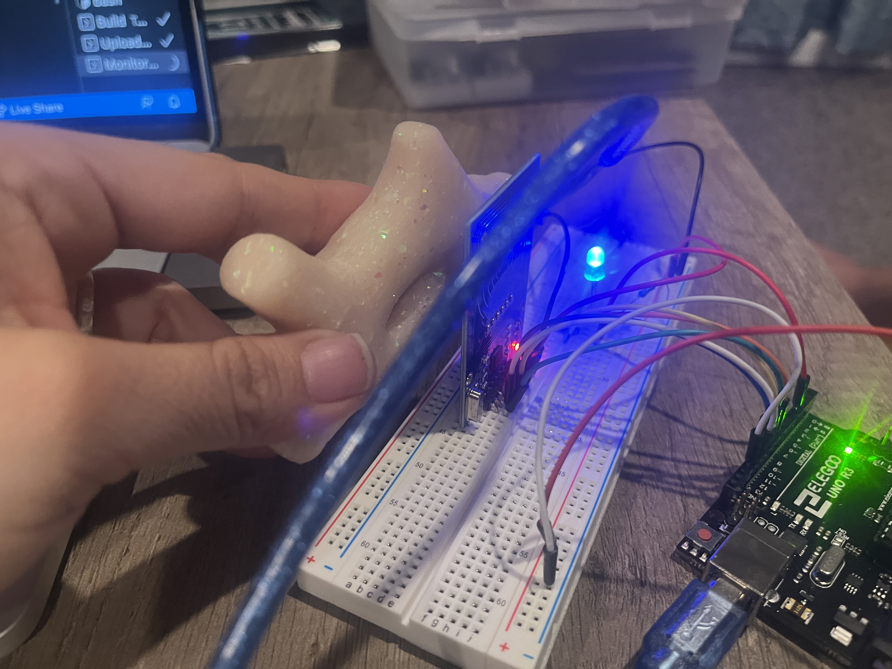
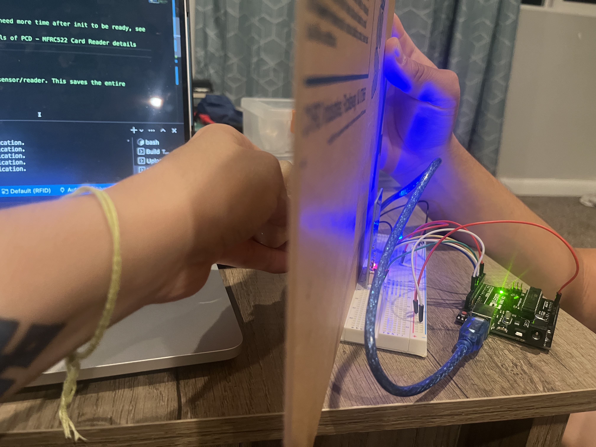

# Midterm Project  

I feel like I am taking one step back everytime I make progress on this project. The reader keeps messing up, and it seems like differently every single time. I tried changing the wires to a different set up, but it is still functioning spotty.  

I tried replacing all the wires but that didn't work - still doing weird stuff.  

I got the single light to work with the RFID, and tested to make sure it would still read through plexi. I didn't think it would be an issue, as it was the same thickness - but wanted to makes sure the material was not going to cause problems.  

