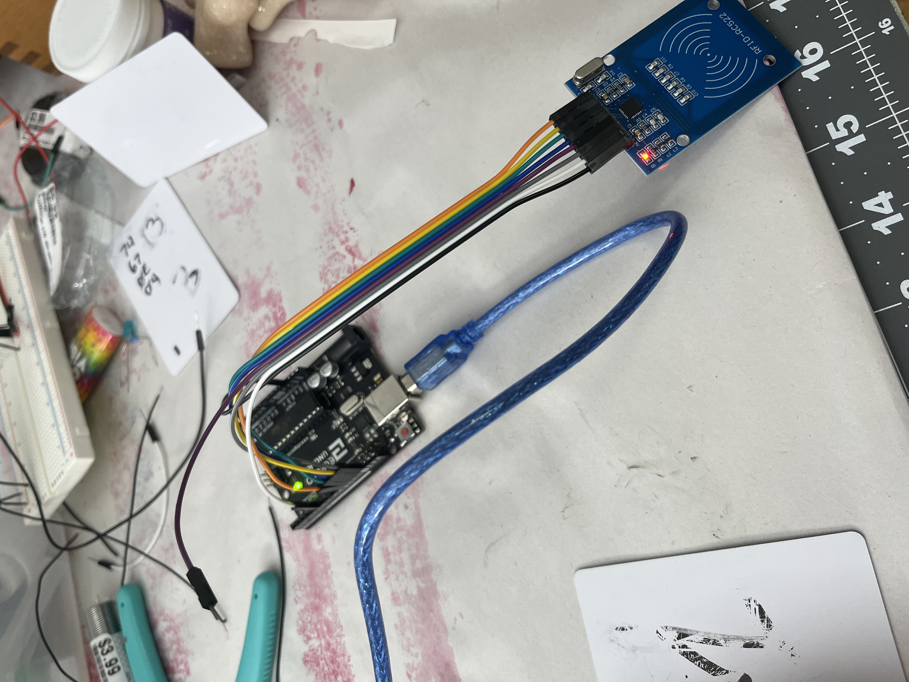
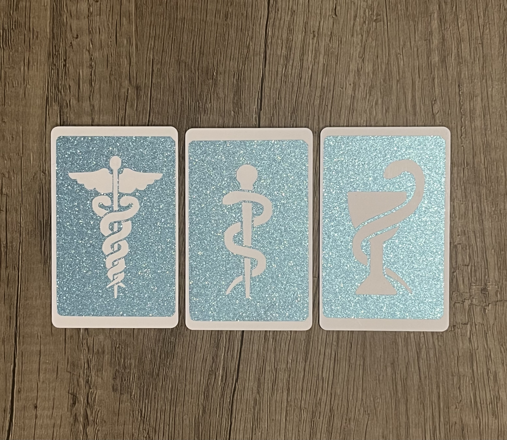

# Midterm Project  

I tried to fix the wires again, trying by first replacing the wires with different ones from the kit and then trying to use wires I had cut from a larger spool. Both didn't work and out of pur frustration I looked up how to skip the breadboard entirely. I had a suspicion that it was causing problems, and it was. After fixing things, I went back and stuck wires into the breadboard and found huge dead spots due to the tension not being enough to hold things. I was curious enough to rip the backing off and look at the clips, and many of them were very loose.  

  
  

I think I am going to try to skip the breadboard for future set ups, if it's possible. I have a second one from my other kit that seems to work better, and will also be trying that to see if I have any better luck.  

I finished the design for the cards, which I am very proud of. I love how they came out. I also had to test that to make sure the metallic and adhesive were not going to interfere with the reader.  

  
