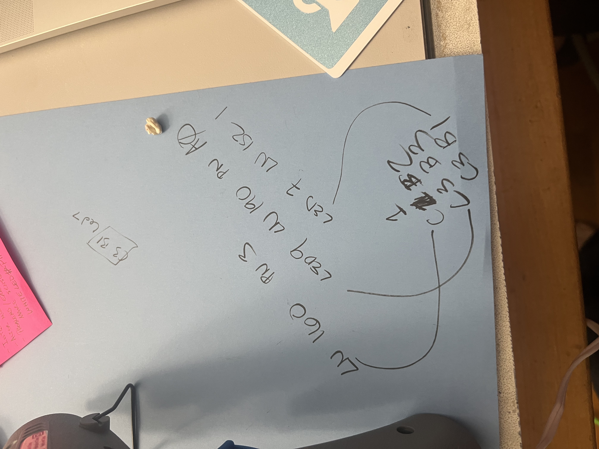
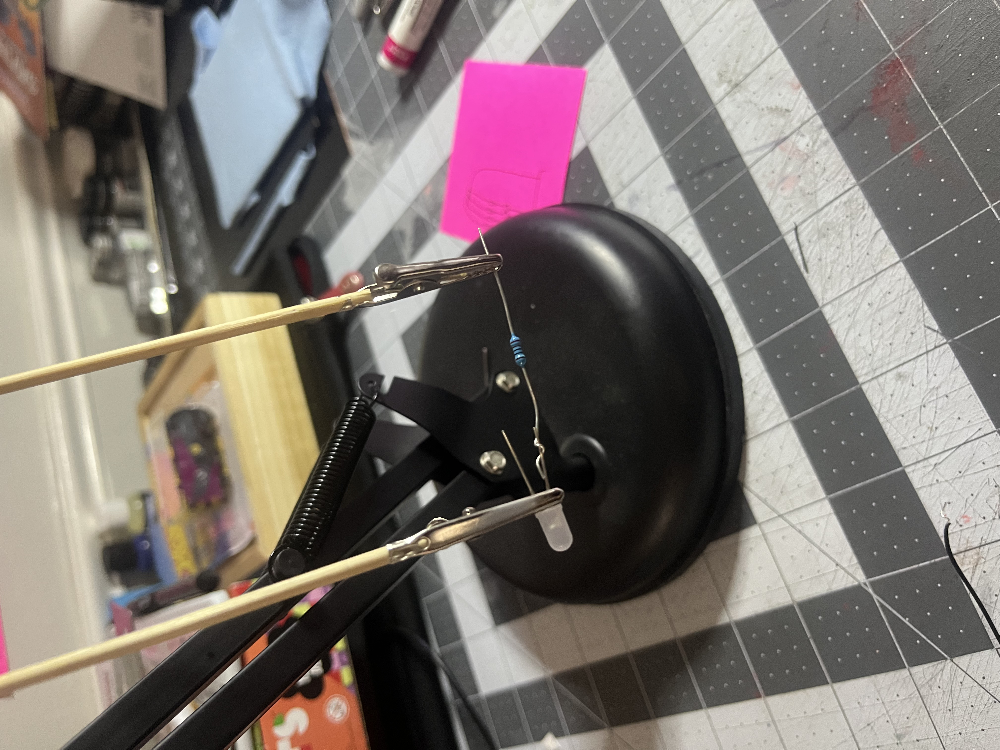
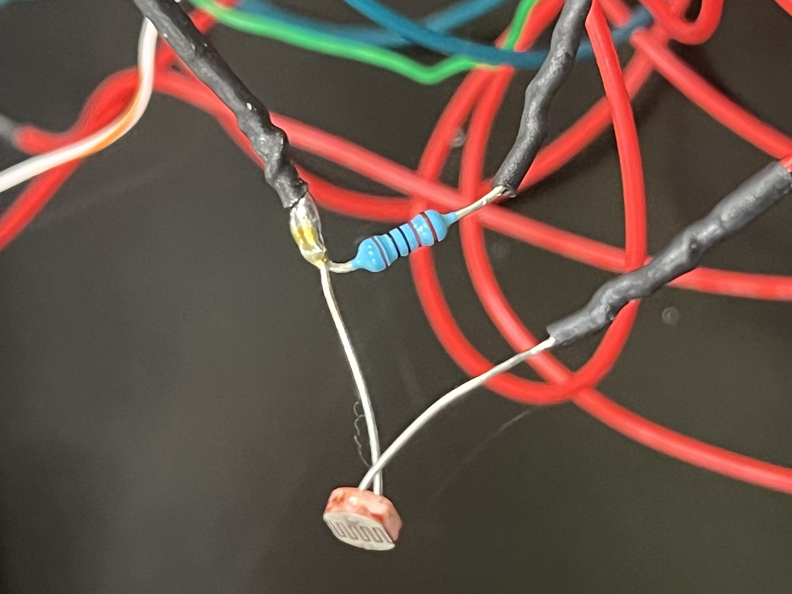
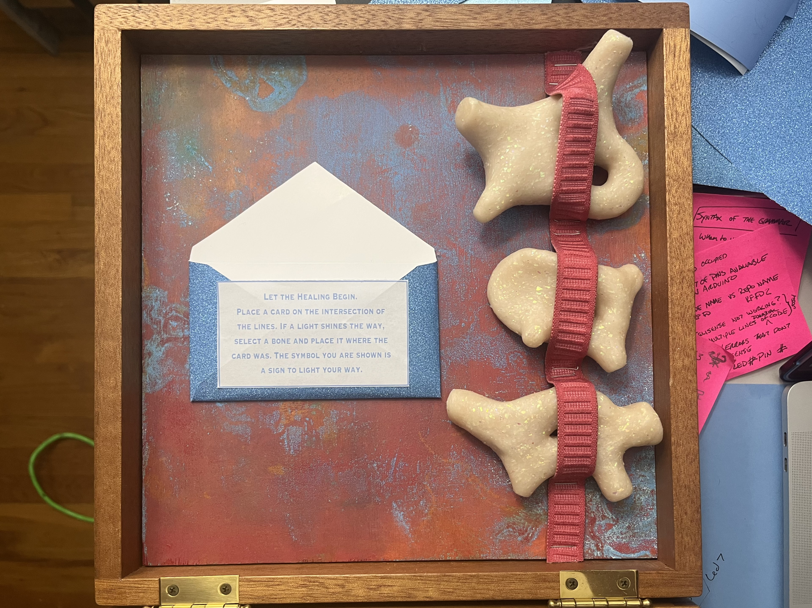

# Midterm Project  

I was struggling right up till the last minute. There were issues in the code with timing, which I fixed after a lot of trial and error of just changing things that I thought were not working and changing them back when it didn't fix something. There were some issues with the cards and bones, and I had to go through and check each individual connection and take notes so I could figure out where to make the change. One change would inevitablely change something else, and another combo would stop working. After a lot of messing around, it got to a point where it was functional enough. It wasn't doing exactly what I wanted, but it was working well enough.  

I did not have a proper claw tool, so I used the lamp coil and some wooden sticks with clips to hold each LED setup as I soldered.  

  

The last design piece for the LEDs was the vinyl ring that would go on the back of the plexi to only let light through where the design was cut out. I have employed a similar technique with other projects and knew I would only need to adjust the spacing from the LED to make it legible.   

  

I had notes from class on how to hook up the wires and leds, but needed extra visuals to help me understand so I asked to take a picture of how Trinity's finished, soldered set up looked. I have a lot of problems with abstractions and do much better with concrete pictures and materials.  

  

Here is my soldered set up:

  

The final project inside lid:

