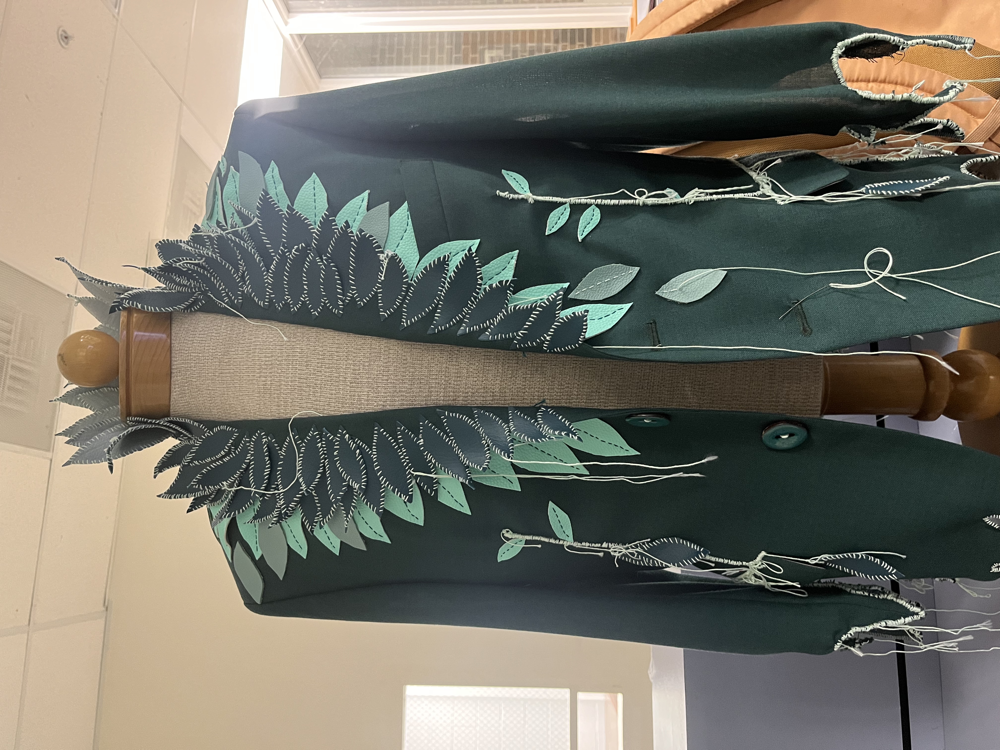
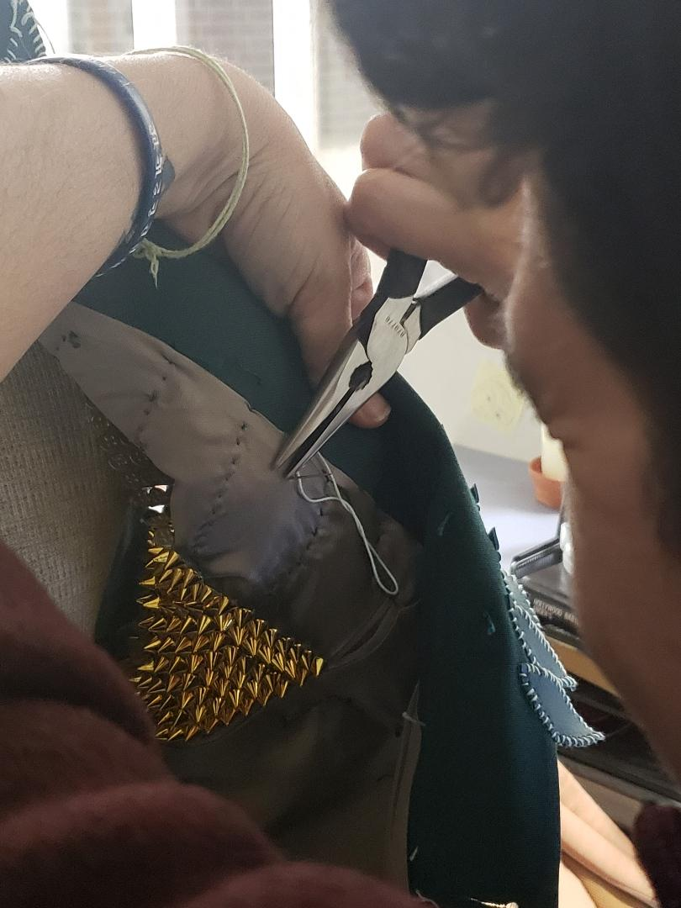

# Final Project  

For my final project, I will continue making a series of boxes of different sizes to add on to the initial experience of the first one. This will be done to replicate the experience of being "examined" by machines and remaining untouched by the hands of the doctor. This is a common experience for disabled people, especially after covid, where healthcare providers' natural biases towards disabled individuals are heightened and more noticeable by what they do and don't do during an office visit.  

The next box would be a play off the outputs from the first box, so the participant would take the 1-3 symbols the first machine gave them and use those to select the appropriate corresponding buttons. The combination of button pushes would then result in a micro printer giving them a small piece of paper with a Romani phrase on it. I have been collecting these saying for years - both those of my own ethinic group, Cale, and other tribal groups. These sayings are often based in natural observation and have some amount of humor to them. For instance: "It was in the water that I learned to swim." The obviousness of this statement makes it somewhat funny, but it reminds us that we often lose sight of the big picture while we are learning, and that turbulence, conflict, and failure are inherent parts of the process of life.  

Another option is to further complicate the interaction with a third box and have the second box give an unreadable output to the user - a QR code. The user/patient would then scan the QR code with a phone or a device connected to box that could give the Romani sayings as a third output.  

I also want to finish my Growth Coat - a wearable art piece that I am nearing completion on the fabrication on. I am going to use conductive thread and sew in a series of LED sequins that react to a proximity sensor and light up when someone approached the piece.  

Here is the most recent picture of the coat:

  
  
