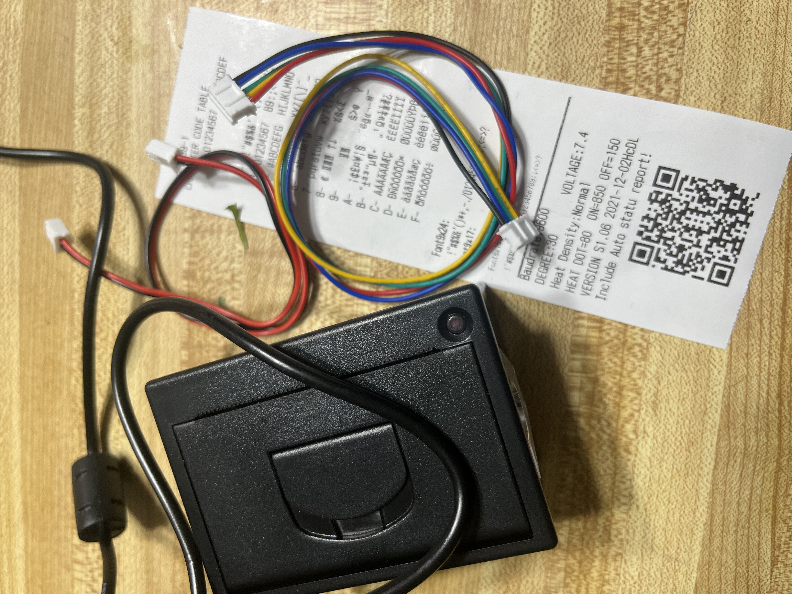

# Final Project  

Checklist for progress this week:

- locate and purchase or make suitable boxes for the next few additions
- hook up and experiment with micro printer
- hook up and experiment with buttons
- design vinyl button covers
- design bitmapped images for print out that are compatible with the micro printer

I also want to see if I can get the sequin LEDs working before review for the growth coat.  

Here is a picture of the micro printer:

