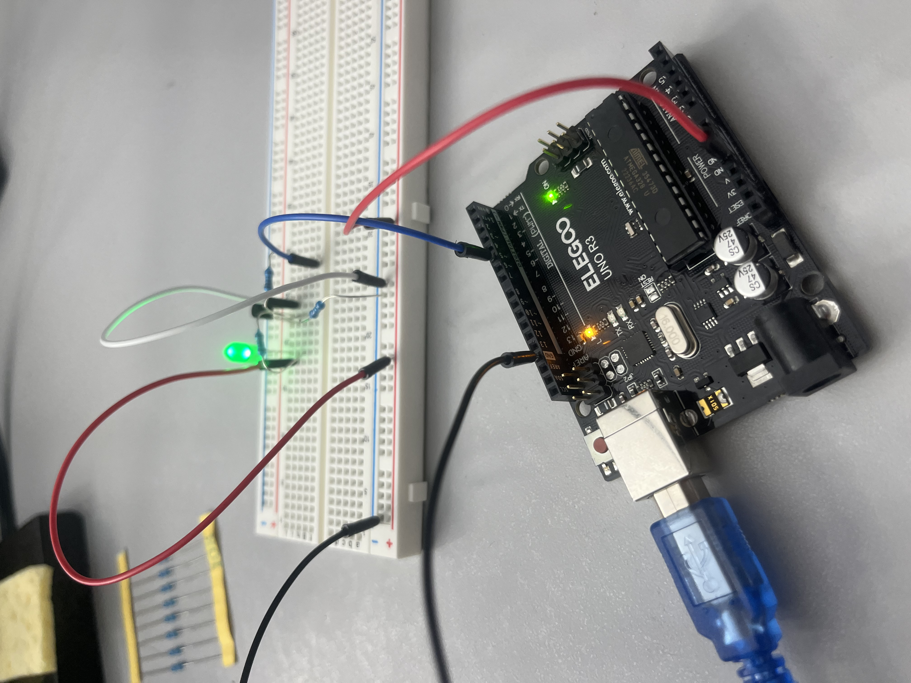

# Make-up Lab  

I sat down and tried the lab I missed this weekend. I was only able to get to page 6, and was afriad to try and guess at some of what was in the text. I could not locate the MOSFET - I looked in the arduino kit and did not see it listed as a component. I also looked up a MOSFET online and did not see it in my kit. I don't know if this is something that was handed out in class that I didn't get or if it is missing from both my kits. I also tried looking up all the part I did have by part number and no luck.  

The first part of the lab was very difficult to figure out, and I had to go back into every single lab we have done until this point to find the code that I needed and I am still not sure I did it right. Either way, here is the setup with the fade working:  

  
