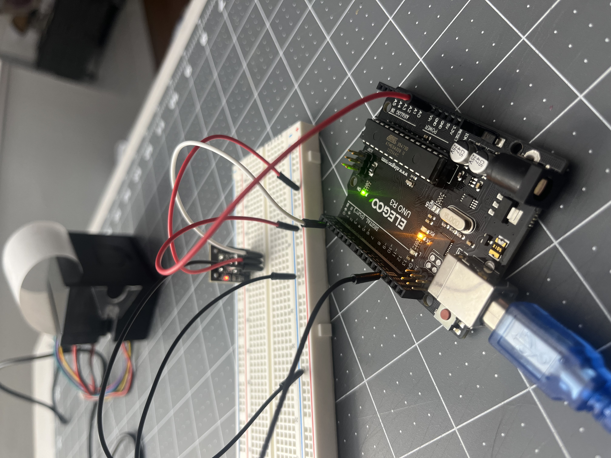
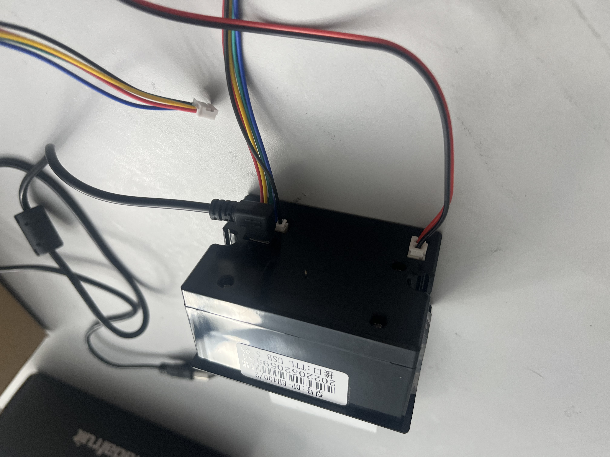
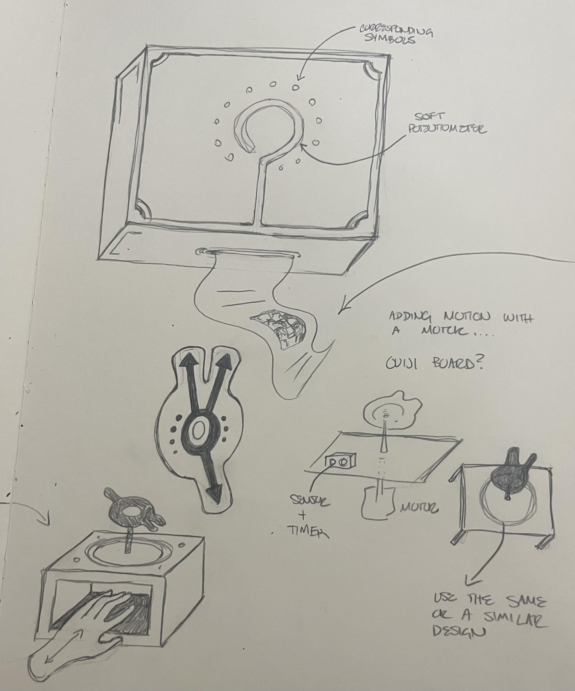
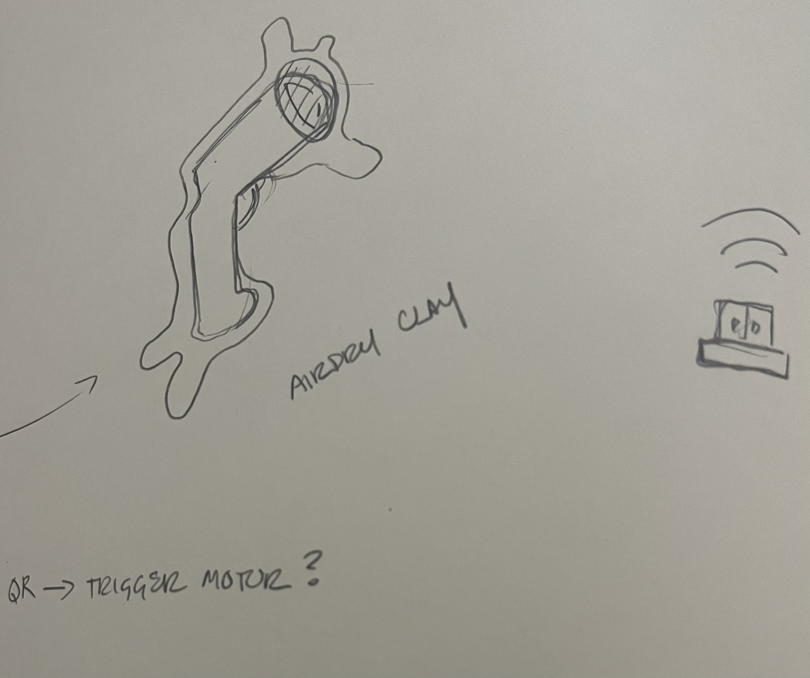

# Previous Lab with Motors  

I do not have time at the moment to go back and do the second half of the previous lab. I am preparing for review while still recovering from being sick, as well as preparing for major surgery this summer. I will revisit it this upcoming weekend, as it might be something I want to use for this project or for future endeavors during the summer.  

## IR Remote Lab  

The first part was easy enough to set up. I got the remote to turn the light on, but had some trouble with trying to understand what change in the code to get it to stay on. I would like to see that explained step by step in class if that is possible.

  

### Progress on Final Project  

I tested the setup and functionality of the micro printer, because I know for sure I want this to be a physical output for one of my boxes. I have not decided how I want the printer triggered. I still have my soft potentiometer that I want to try getting to work.  

  

I have made some additional sketches for my plans with this project after this class, as it is something I plan to continue pursuing over the summer. I still see these as a set of devices as a way to mirror the complexities of generalist and specialist interractions within the medical field.  

  
  
  
