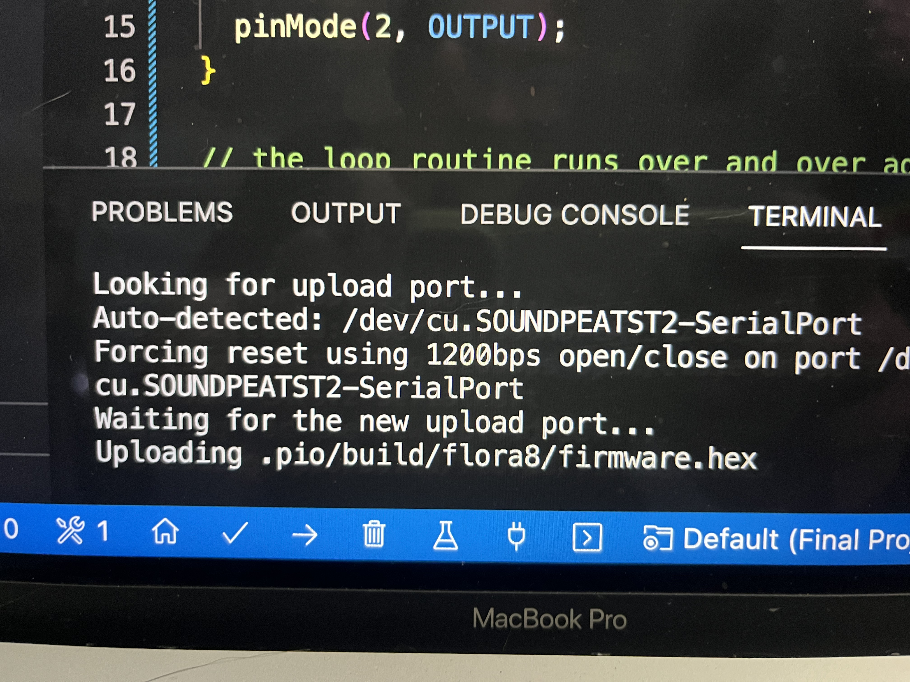
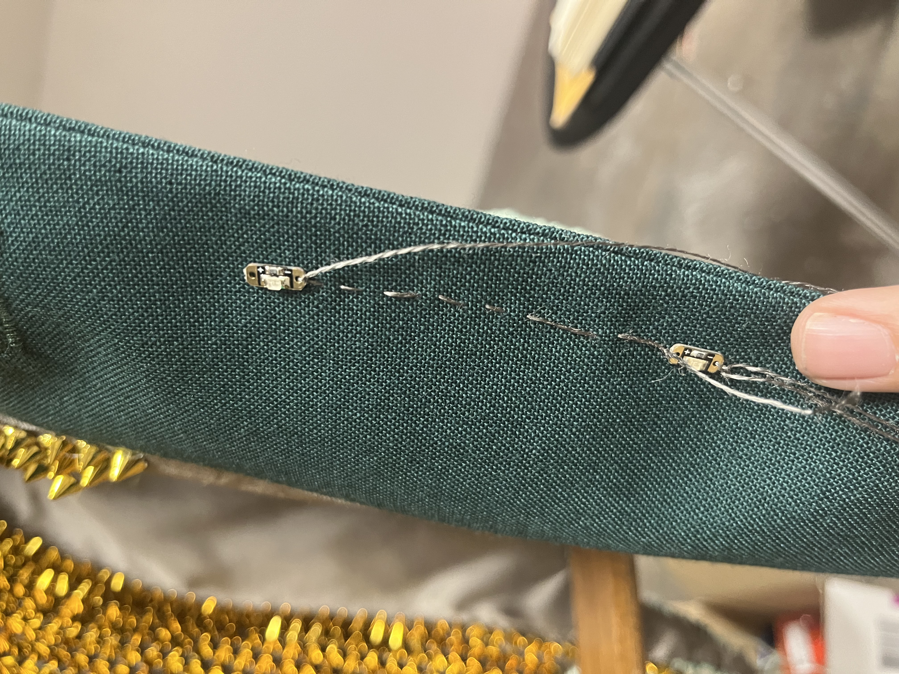
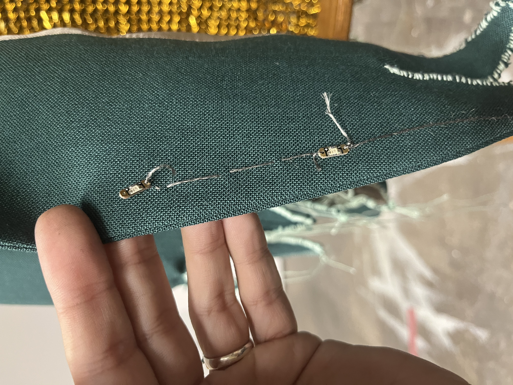

# Final Project Updates  

I did a bunch of research to make sure I was sewing the sequins in properly before getting started.

  
  

The first test went fine, which was using the microconnector to have the Flora board turn on and then blink the on board led.  

  

I wanted to make sure I could have the Flora opperate idependently without being hooked up to the computer, so I tried to test just uploading a full program to the board. When I tried to do this, I got an error message over and over at the secon step telling me it was trying to connect with my blue tooth speaker.  

  

Once I was happy with circuit I had figured out and drawn, I decided it was safe to start sewing the sequins into the coat itself. The knots seemed to be holding and then started to come undone as I moved the coat and thread around while trying to manipulate the needle through the material. I did more research and found advice to put a small dab of hot glue or clear nail polish on the connection to the sequin to secure the thread. I am going to do some research on knots to see if I can find a more secure knot, as well as following the advice of dabbing on the clear nail polish as a sealant.  

  
  

[MakeCodeSparkle] <https://learn.adafruit.com/easy-sparkle-pocket-t-shirt/code-with-makecode>  
[FloraCircuitMakeCode] <https://makecode.adafruit.com/#editor>  
[Flora] <https://wikifactory.com/@botler/techniques-for-flora>  
[ChangeSerialPort] <https://docs.platformio.org/en/latest/projectconf/sections/env/options/upload/upload_port.html>  
