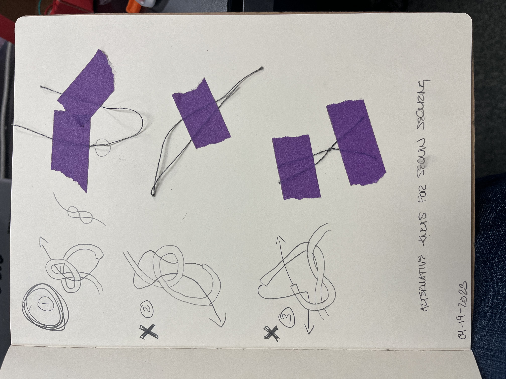

# Final Project Progress  

In class, I researched and tried out three different kinds of knots.

  

The first knot seems to be the winner. The second and third knots started coming undone after playing with them for a bit. I'm going to try undoing the stitching on the four leds and redoing it with the new knot, although I think it would still be helpful to add a bit of the clear nail polish to add some extra security.  

[KnotsWikki] <https://www.wikihow.com/Tie-Strong-Knots>  
[KnotsSewing] <https://sewguide.com/sewing-thread-knot/>  
